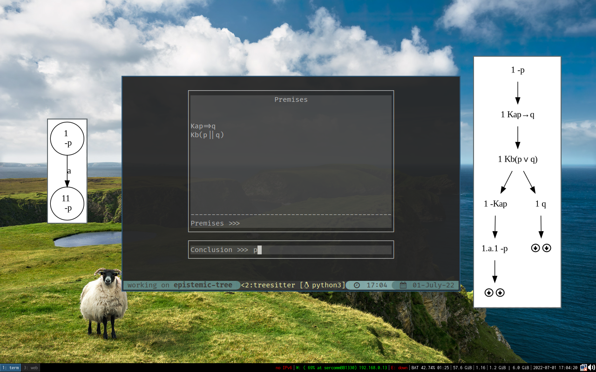
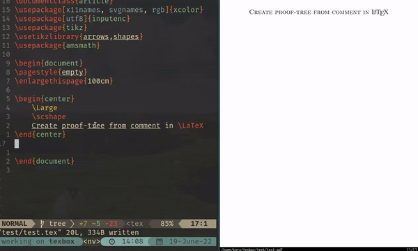

# Epistemic tree
## Índice
* [Introducción](#introducción)
* [Lenguaje](#lenguaje)
* [Interfaz](#Interfaz)

## Lenguaje

| Símbolo | Fórmula      | Ejemplo |
|---------|--------------|---------|
| &&      | Conjunción   | p&&q    |
| \|\|      | Disyunción   | p\|\|q    |
| =>      | Implicación  | p=>q    |
| Ka      | Conocimiento | Kap     |

El conjunto de átomos se define como [p-z] y el conjunto de átomos [a-d].

## Ejecución
1. `git clone https://github.com/cagve/epistemic-tree`
2. `cd epistemic-tree/`
3. `python3 -m epistemictree <args>` 

### Args
* [Req] `-s --system` > Sistema a utilizar. Opciones: [k, kt, kt4, k4]
* [Req] `-f --formula` > Lista de fórmulas, escrito entre comillas y separados por comas
* `-o --output` > Output img
* `-c` > Añade las clausuras

Ejemplos: 

## Interfaz
### Consola
El programa se ejecuta como modulo python. Para utilizarla se introduce un
conjunto de premisas, que puede ser vacío, y la conclusión. Una vez ejecutamos
el programa, se crea la imagen del árbol generado y, en caso de que sea posible,
construye un contramodelo.

  

### Vim
También puede utilizarse dentro de editores de texto para LaTeX. En este caso,
se muestra un ejemplo del funcionamiento para Neovim. 

  

